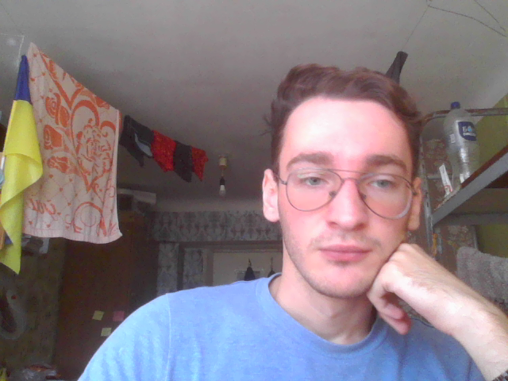
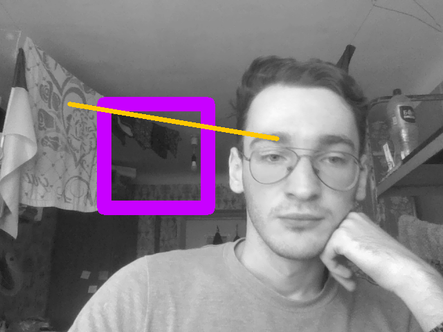

# Crete and edit an image and a video

## Task
Лаба №1: A toe into madness  

Встановити OpenCV, зчитати зображення з вебки, відобразити в першому віконці та записати його на диск. Після цього зчитати щойно записане зображення з диску, конвертувати у відтінки сірого та намалювати на ньому довільних кольорів лінію та прямокутник (наприклад червону лінію та синій прямокутник) і відобразити у другому віконці. Ні це не психотест, для дебагу це ще й як знадобиться. Бонуси за виконання цих кроків для відеоряду і бонуси до бонусів якщо в результаті цих кроків замість звалища картинок матимемо відеофайл (наприклад .avi).

## Info
- [code for an image](lab2/image_main.py) 
- [code for a video](lab2/video.py) 
- [resulting files](lab2/files) 

### Created Image

### Edited Image

### Created Video

### Edited Video

